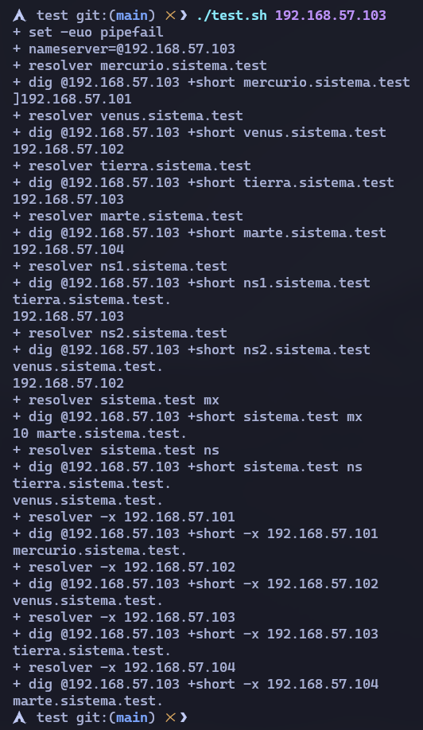
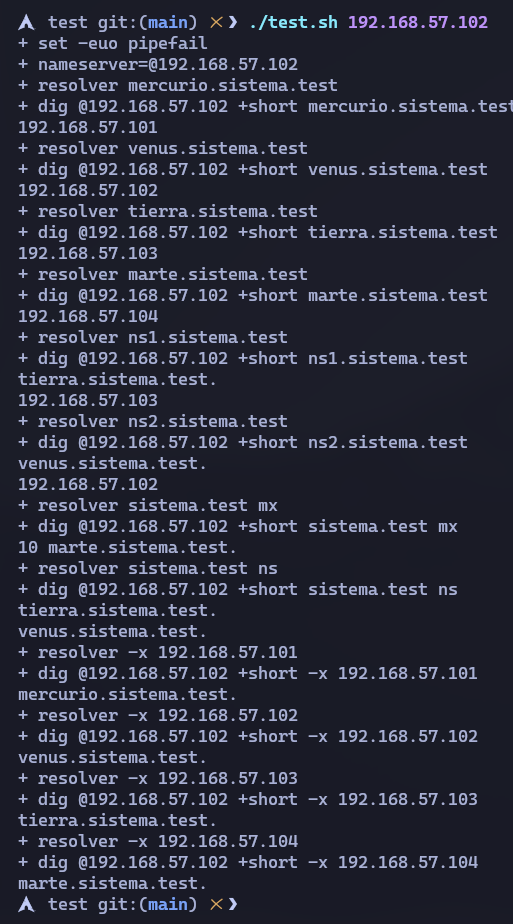

# DNS SERVER

## :snowflake: Description
This project implements a DNS service using [BIND](https://www.isc.org/bind/) (Berkeley Internet Name Domain) on two virtual servers configured with Vagrant: **a master server and a slave server**. The main goal is to provide a redundant DNS infrastructure by transferring zone from the master to the slave.

The `Vagrantfile` configures both virtual machines and provisions the servers with the necessary zone files so that they can resolve names and IP addresses associated with the `sistema.test` domain. The zone transfer between the master (earth) server and the slave (venus) server ensures that both servers maintain up-to-date information. The mars and mercury servers are included as additional hosts in the domain.

> All the computers in this project will be located within the 192.168.57.0/24 network.

**Network structure:**

|      Machine      | Fully Qualified Domain Name (FQDN) |     IP     |
|-------------------|------------------------------------|------------|
|  Graphical Linux  |        mercurio.sistema.test       |   .101     |
|      Debian1      |          venus.sistema.test        |   .102     |
|      Debian2      |         tierra.sistema.test        |   .103     |
|  Windows Server   |          marte.sistema.test        |   .104     |


## :snowflake: Project Structure

The project is organized in two DNS servers:

**Master Server (tierra)**:
- IP: 192.168.57.103
- Responsible for storing the main zone files and answering DNS queries.
- Configured to allow zone transfer to the slave server.

**Slave Server (venus)**:
- IP: 192.168.57.102
- Receives zone information via transfer from the master server.
- Serves as a backup DNS server to answer queries in case of failure of the master server.

**Mail Server (marte)**:
- IP: 192.168.57.104
- Serves as mail server for the system.test domain.
- Registered as MX in the zone files.

**Additional Server (mercurio)**:
- IP: 192.168.57.101
- Additional server for DNS resolution testing.
- Registered as an A host in the domain.

### DNS Configuration
The configuration of zone files and BIND settings are handled by configuration files in `/etc/bind/` and zone files in `/var/lib/bind/`.

#### Configuration files

- `named.conf.options`: In this file you configure general settings that affect the behavior of the server globally. Some of the key settings that can be defined in this file include:
  - **Forwarder**: Specifies external DNS servers to which the BIND server will send queries that it cannot resolve locally. In our case, they will be sent to the address `208.67.222.222` ([OpenDNS](https://www.opendns.com/)).
  - **ACLs (Access Control Lists)**: Defines rules that control access to the DNS server. In our case we have defined the “trusted” networks and the listening addresses that will listen on port 53 for requests.

    ```bash
    acl trusted {
	192.168.57.0/24;
	127.0.0.0/8;
    };


    acl listen-addresses {
        192.168.57.103;
        192.168.57.102;
        127.0.0.1;
    };
    ```
  - **Recursion**: Controls whether the server will perform recursive queries on its own or return an error if it is unable to resolve a domain locally.

  - **Listen-on**: Specifies on which network interfaces and ports the DNS server will be listening for requests.

    ```bash
    listen-on port 53 { listen-addresses; };
    ```
  - **dnssec-validation**: Enables DNSSEC (Domain Name System Security Extensions) validation. DNSSEC is a set of security extensions for DNS that ensures that responses to DNS queries have not been altered during transmission and come from an authentic source.

    ```bash
    dnssec-validation yes;
    ```

- `named.conf.local` (maestro - tierra)

    ```bash
    zone "sistema.test" {
    type master;
    file "/var/lib/bind/sistema.test.dns";
    allow-transfer { 192.168.57.102; };
    };

    zone "57.168.192.in-addr.arpa" {
        type master;
        file "/var/lib/bind/sistema.test.rev";
        allow-transfer { 192.168.57.102; };
    };
    ```

- `named.conf.local` (esclavo - venus)

    ```bash
    zone "sistema.test" {
    type slave;
    file "/var/lib/bind/sistema.test.dns";
    masters { 192.168.57.103; };
    };

    zone "57.168.192.in-addr.arpa" {
        type slave;
        file "/var/lib/bind/sistema.test.rev";
        masters { 192.168.57.103; };
    };
    ```

- `system.test.dns`: direct zone file containing name records to IP addresses. It also includes aliases for the name servers and the mail server.

    ```bash
    $TTL	86400
    $ORIGIN sistema.test.

    @	IN	SOA	tierra root.sistema.test. (
                    2		; Serial
                604800		; Refresh
                86400		; Retry
                2419200		; Expire
                   7200 )	; Negative Cache TTL

    ; Name servers NS 
    @		IN		NS		tierra
    @		IN		NS		venus

    ; Aliases
    ns1		IN		CNAME	tierra
    ns2		IN		CNAME	venus

    ; Mail server
    @		IN		MX		10 marte

    ; Servers directions
    tierra		IN		A		192.168.57.103
    venus		IN		A 		192.168.57.102
    marte		IN		A 		192.168.57.104
    mercurio	IN		A 		192.168.57.101

    ; Mail alias
    mail		IN		CNAME	marte
    ```

- `system.test.rev`: reverse zone file that associates IP addresses to names. 
 
    ```bash
    ;
    ; 57.168.192
    ;

    $TTL	86400
    $ORIGIN 57.168.192.in-addr.arpa.

    @	IN	SOA	tierra.sistema.test root.sistema.test. (
                    1		; Serial
                604800		; Refresh
                86400		; Retry
                2419200		; Expire
                  7200 )	; Negative Cache TTL
    ; Name Servers
    @		IN		NS		tierra.sistema.test.
    @		IN		NS		venus.sistema.test.

    ; Reverse directions
    103		IN		PTR		tierra.sistema.test.
    102		IN		PTR		venus.sistema.test.
    104		IN		PTR		marte.sistema.test.
    101		IN 		PTR		mercurio.sistema.test.
    ```

### Architecture
The DNS is configured for the `sistema.test` domain with the following key elements:
 - **NS (Name Servers)**: defines the DNS servers responsible for resolving the domain.
 - **A records**: Associates server names to IP addresses.
 - **CNAME records**: Aliases that redirect one name to another.
 - **MX records**: Defines the mail servers for the domain.
 - **PTR records**: Records for reverse resolution (IP to name).

 ## :snowflake: Vagrant configuration
 The `Vagrantfile` configures the master and slave servers.

 ### Provisioning
 To provision the machines we use the file `scripts/provision.sh` where several functions are defined depending on the machine we are going to provision.

- **General provision**: To update the repositories and install bind 9 and its utils. Provision the machines with the `named` file and with the `named.conf.options` which is common for the master server and the slave server.
    ```bash
    function general_provision() {
        echo -e "Updating and upgrading the repositories in $machine_name..."
        apt-get update -y && apt-get upgrade -y
        echo -e "Instaling bind9 and utils in $machine_name..."
        apt-get install -y bind9 bind9utils bind9-doc

        # Common config files
        echo -e "Provisioning the dns server, master and slaves..."
        cp -v /vagrant/files/named /etc/default/
        cp -v /vagrant/files/named.conf.options /etc/bind/
    }
    ```

- **Specific provisioning for each server**: Provisioning of specific files for each server, tiera and venus.

    - **Tierra provisioning**: In this provision we copy `named.conf.local` to `/etc/bind/`, and move the direct and inverse zone files to `/var/lib/bind/`.

        ```bash
       function tierra_setup() {
            echo -e "Provisoning $machine_name files..."
            cp -v /vagrant/files/tierra/named.conf.local /etc/bind/
            cp -v /vagrant/files/sistema.test.dns /var/lib/bind/
            cp -v /vagrant/files/sistema.test.rev /var/lib/bind/ 
            chown bind:bind /var/lib/bind/*
            systemctl restart named
        }
        ```

    > [!IMPORTANT] 
    > It is necessary to make sure that the user and group that owns the zone files is `bind`, so that it can have read permissions to execute them and perform the zone transfer.

    - **Venus provisioning**: In the case of venus, we provision its local configuration file `named.conf.local`.

        ```bash
       function venus_setup() {
            echo -e "Provisioning $machine_name files..."
            cp -v /vagrant/files/venus/named.conf.local /etc/bind/ 
            systemctl restart named
        }
        ```

- **Main function**: Where the program flow is controlled.

    ```bash
    function main() {
        if [ "$machine_name" == "tierra" ]; then
            general_provision
            tierra_setup
        elif [ "$machine_name" == "venus" ]; then
            general_provision
            venus_setup
        else
            echo -e "Machine not recognized"
            exit 1
        fi
    }

    main
    ```

## :wrench: Setup
To make the automatic deployment of the whole project we only have to enter the following command inside the working directory:

```bash
$ vagrant up
```

## :snowflake: Functional Checks
Una vez configurado el proyecto, puedes realizar varias comprobaciones para asegurarte de que el DNS funciona correctamente.

### Zone transfer
On the slave (venus), we can execute the following command to force the zone transfer:

```bash
$ dig @192.168.57.103 sistema.test AXFR
```

If the zone transfer is successful, the following output will be displayed:

<div align="center">
    
</div>

In parallel on the tierra server we can enter the following command to display the logs of the named service in real time (by the -f parameter):

```bash
$ sudo tail -f /var/log/syslog | grep named
```

This log indicates that the slave server (venus) has successfully requested and received the system.test zone transfer from the master server (earth). The output shows that the process was completed smoothly and successfully:

<div align="center">
    
</div>

### Query DNS Records

We can use `nslookup`or `dig` to check the different records on both servers.

#### Dig

- We can check the NS servers of the domain:

    ```bash
    $ dig @192.168.57.103 sistema.test NS
    ```

<div align="center">
    
</div>

- Check the resolution of a domain name:

    ```bash
    $ dig +short @192.168.57.103 tierra.sistema.test
    ```

<div align="center">
    
</div>

- Resolver una IP a un nombre (resolución inversa):

    ```bash
    $ dig -x 192.168.57.103 @192.168.57.103
    ```

<div align="center">
    
</div>

- Check the MX mail servers:

    ```bash
    $ dig +short @192.168.57.103 sistema.test MX
    ```

<div align="center">
    
</div>


## :snowflake: Testing
To test the correct functioning of the DNS servers we have the script `test/test.sh`, which we will pass as parameter the network interface of the server we want to check and it will make the queries with dig for us.

- Passing the test to the tierra server:

    ```bash
    $ chmod +x test/test.sh
    $ cd test/
    $ ./test.sh 192.168.57.103
    ```

<div align="center">
    
</div>

- Passing the test to the venus server:

    ```bash
    $ ./test.sh 192.168.57.102
    ```

<div align="center">
    
</div>


## :snowflake: License

This project is under <a href="https://github.com/sporestudio/dns-server/blob/main/LICENSE">GNU General Public License v3.0</a>


## :snowflake: Author

Created by <a href="https://github.com/sporestudio/">sporestudio</a>.
